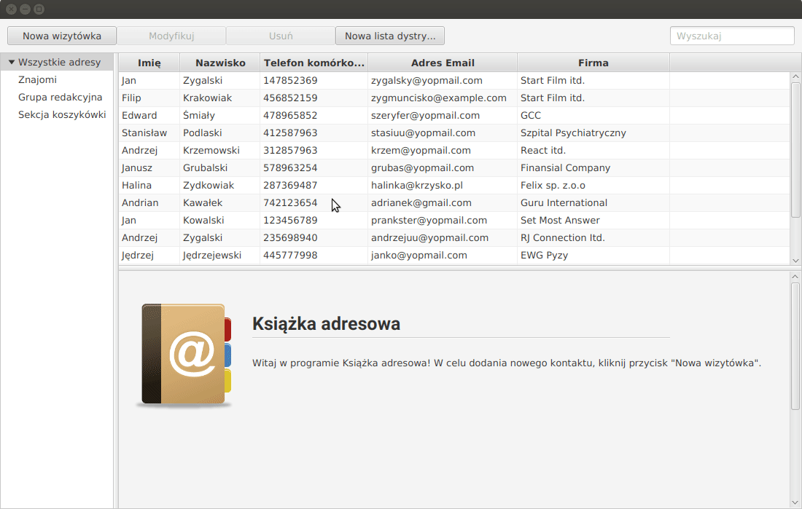

# AddressBook
Książka adresowa napisana przy użyciu JavaFX oraz SQLite inspirowana programem Mozilla Thunderbird. Projekt zrealizowano w ramach laboratoriów Języków Programowania Obiektowego (Politechnika Poznańska).

Funkcje
====================
* Wykorzystanie bazy SQLite do przechowywania danych
* Wykorzystanie formularzy FXML do generowania widoków 
* Możliwość zaznaczania i usuwania wielu kontaktów jednocześnie
* Dodawanie oraz edycja kontaktów za pomocą rozbudowanego edytora
* Automatyczny podgląd zaznaczonych kontaktów 
* Wyszukiwanie kontaków za pomocą pola wyszukiwarki
* Możliwość dodawania kontaktów do list dystrybucyjnych
* Modyfikacja i usuwanie list dystrybucyjnych razem z kontaktami
